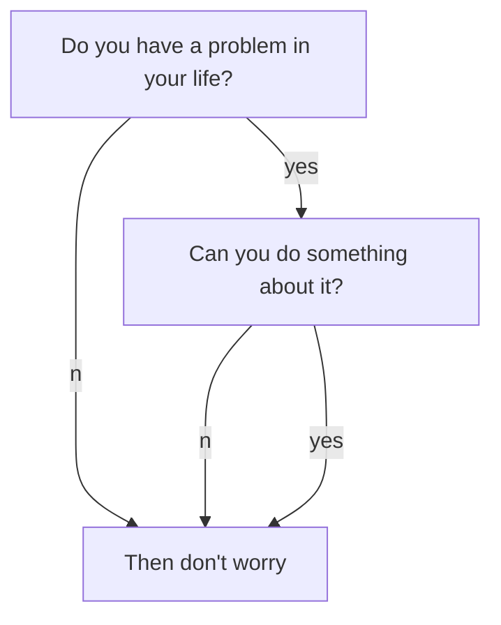

# 概述

运营相关文档资料更新及存储。可查看及下载。

```mermaid
graph TB;
    A[Do you have a problem in your life?]
    B[Then don't worry]
    C[Can you do something about it?]
    A--no-->B;
    A--yes-->C;
    C--no-->B;
    C--yes-->B;
```
