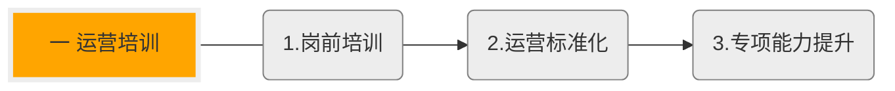
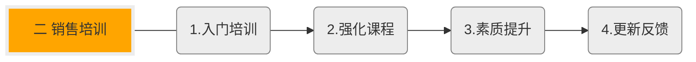

# 概述

运营相关文档资料更新及存储。可查看及下载。

```mermaid
graph LR
    A["一 运营培训"]
    A---B(1.岗前培训);
    B-->C(2.运营标准化);
    C-->D(3.专项能力提升);
    style A fill:orange,stroke:#EDEDED,stroke-width:4px
    style B fill:#EDEDED,stroke:gray,stroke-width:1px
    style C fill:#EDEDED,stroke:gray,stroke-width:1px
    style D fill:#EDEDED,stroke:gray,stroke-width:1px
```

```mermaid
graph LR
    A["二 销售培训"]
    A---B(1.入门培训);
    B-->C(2.强化课程);
    C-->D(3.素质提升);
    D-->E(4.更新反馈);
    style A fill:orange,stroke:#EDEDED,stroke-width:4px
    style B fill:#EDEDED,stroke:gray,stroke-width:1px
    style C fill:#EDEDED,stroke:gray,stroke-width:1px
    style D fill:#EDEDED,stroke:gray,stroke-width:1px
    style E fill:#EDEDED,stroke:gray,stroke-width:1px
```
