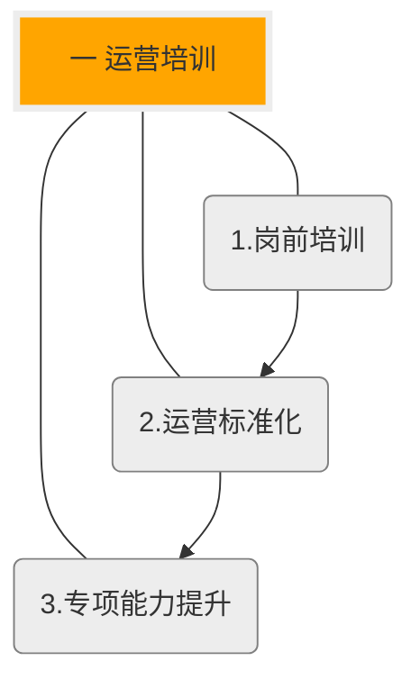

# 概述

运营相关文档资料更新及存储。可查看及下载。

```mermaid
graph TD
    A["一 运营培训"]
    A---B(1.岗前培训)
    A---C(2.运营标准化);
    A---D(3.专项能力提升);
    B-->C;
    C-->D
    style A fill:orange,stroke:#EDEDED,stroke-width:4px
    style B fill:#EDEDED,stroke:gray,stroke-width:1px
    style C fill:#EDEDED,stroke:gray,stroke-width:1px
    style D fill:#EDEDED,stroke:gray,stroke-width:1px
```
