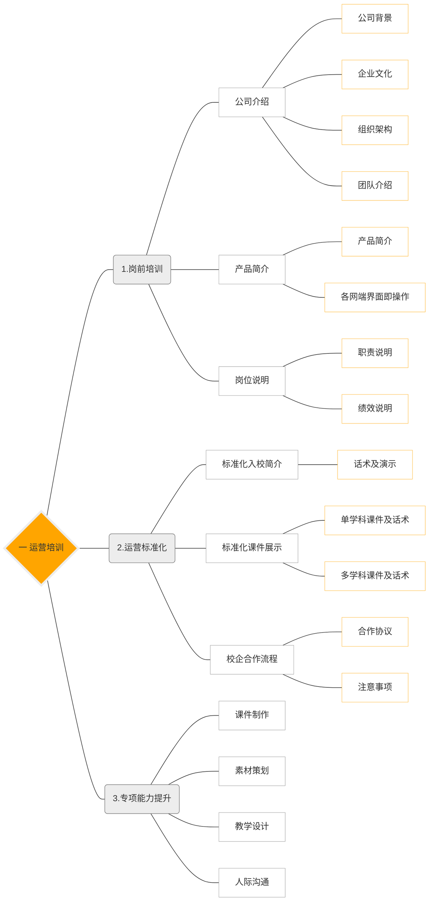

<bro/><bro/>

```mermaid
graph LR
    A{一 运营培训} --- a( 1.岗前培训 ) 
    style A fill:orange,stroke:#EDEDED,stroke-width:4px
    style a fill:#EDEDED,stroke:gray,stroke-width:1px
    a---1[公司介绍] ;
    style 1 fill:white,stroke:gray,stroke-width:0.5px
    1---01[公司背景] ;
    style 01 fill:white,stroke:orange,stroke-width:0.5px
    1---02[企业文化] ;
    style 02 fill:white,stroke:orange,stroke-width:0.5px
    1---03[组织架构] ;
    style 03 fill:white,stroke:orange,stroke-width:0.5px
    1---04[团队介绍] ;
    style 04 fill:white,stroke:orange,stroke-width:0.5px
    a---2[产品简介] ;
    style 2 fill:white,stroke:gray,stroke-width:0.5px
    2---05[产品简介] ;
    style 05 fill:white,stroke:orange,stroke-width:0.5px
    2---06[各网端界面即操作] ;
    style 06 fill:white,stroke:orange,stroke-width:0.5px
    a---3[岗位说明] ;
    style 3 fill:white,stroke:gray,stroke-width:0.5px
    3---07[职责说明] ;
    style 07 fill:white,stroke:orange,stroke-width:0.5px
    3---08[绩效说明] ;
    style 08 fill:white,stroke:orange,stroke-width:0.5px
    A --- b( 2.运营标准化 )
    style b fill:#EDEDED,stroke:gray,stroke-width:1px
    b---4[标准化入校简介] ;
    style 4 fill:white,stroke:gray,stroke-width:0.5px 
    4---09[话术及演示] ;
    style 09 fill:white,stroke:orange,stroke-width:0.5px
    b---5[标准化课件展示] ;
    style 5 fill:white,stroke:gray,stroke-width:0.5px 
    5---010[单学科课件及话术] ;
    style 010 fill:white,stroke:orange,stroke-width:0.5px
    5---011[多学科课件及话术] ;
    style 011 fill:white,stroke:orange,stroke-width:0.5px
    b---6[校企合作流程] ;
    style 6 fill:white,stroke:gray,stroke-width:0.5px 
    6---012[合作协议] ;
    style 012 fill:white,stroke:orange,stroke-width:0.5px
    6---013[注意事项] ;
    style 013 fill:white,stroke:orange,stroke-width:0.5px
    A --- c( 3.专项能力提升 )
    style c fill:#EDEDED,stroke:gray,stroke-width:1px
    c---7[课件制作] ;
    style 7 fill:white,stroke:gray,stroke-width:0.5px 
    c---8[素材策划] ;
    style 8 fill:white,stroke:gray,stroke-width:0.5px 
    c---9[教学设计] ;
    style 9 fill:white,stroke:gray,stroke-width:0.5px 
    c---10[人际沟通] ;
    style 10 fill:white,stroke:gray,stroke-width:0.5px    
```
